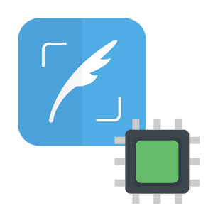

<p align="center">
  <a href="" rel="noopener">
 </a>
</p>

<h3 align="center">Smart Tweet Scrapper</h3>

<div align="center">

[]()


</div>

---


<p align="center"> Smart Tweet Scrapper
    <br> 
</p>

## 📝 Table of Contents

- [About](#about)
- [Getting Started](#getting_started)
- [MQTT Topic Details](#mqtt)
- [Usage](#usage)
- [Built Using](#built_using)
- [Authors](#authors)


## 🧐 About <a name = "about"></a>

This repo contains

- Backend(no config required)
- Firmware
- Detailed instructions

for Smart Tweet Scrapper.


## Getting Started <a name = "getting_started"></a>

These instructions will get you a copy of the project up and running on your system.

### Prerequisites

Things you need to install the FW.

```
- Arduino IDE
```

### Installing <a name = "installing"></a>

A step by step series that tell you how to get the Firmware and Backend running

#### ESP32 Configuration

You should have Arduino IDE Installed

  1.  Add ESP32 Board to your Arduino IDE
    1. In your Arduino IDE, go to File> Preferences
        Installing ESP32 Add-on in Arduino IDE Windows, Mac OS X, Linux open preferences
    2. Enter ```https://dl.espressif.com/dl/package_esp32_index.json``` 
        into the “Additional Board Manager URLs” field then, click the “OK” button:
        Note: if you already have the ESP32 boards URL, you can separate the URLs with a comma(each board will go to neaw line) as follows:
        ```https://dl.espressif.com/dl/package_esp32_index.json,\n http://arduino.esp8266.com/stable/package_esp8266com_index.json```
    
    
  2. Open the Boards Manager. Go to Tools > Board > Boards Manager…
  3. Search for ESP32 and press install button for the ESP32 by Espressif Systems“:
  4. That’s it. It should be installed after a few seconds.
  5.  Now copy the contents of the libs folder to the libraries directory of your Arduino
      1. If you are using windows, the libraries directory will be Documents/Arduino/libraries

##### ESP32 Node FW Uploading
  1.  Select ESP32 Dev Module from Tools->Board->ESP32
  2.  Select the correct port from Tools->Port
  3.  Then open Firmware.ino file,
  4.  Select Tools > ESP32 Sketch Data Upload menu item. This should start uploading the files into ESP32 flash file system.
  5.  Now Upload the Code to your ESP32 Dev Module.
  6.  Your ESP32 is now ready to be used.


## MQTT Topic Details <a name = "mqtt"></a>
### Topics List
#### Setting Hashtag
1.  <span style="color: green">twitter/hashtag_set</span> `(set a hashtag string to get the latest tweet of that hashtag) WRITE-ONLY`
2.  1.  <span style="color: green">twitter/tweet_freq_set</span> `(set the latest tweet check frequency in seconds.) WRITE-ONLY`

#### Getting Latest Tweet

1.  <span style="color: green">twitter/tweet_get</span> `(To get the latest tweet of set hashtag after every one minute) READ-ONLY`


## Usage <a name = "usage"></a>

1.  Make sure to put right WiFi creds in Firmware.ino file line number 13 and 14.
2.  Set the content_get frequency in seconds on line number 189.
3.  Set the hashtag to get tweets from in Firmware.ino file on line number 190.
4.  Upload the code to your ESP32.
5.  Open the serial monitor to see the live tweets being received.
    
## ⛏️ Built Using <a name = "built_using"></a>


- [Arduino](https://www.arduino.cc/) - Embedded Framework and IDE - For Sensor Node Design


## ✍️ Authors <a name = "authors"></a>

- [@Nauman3S](https://github.com/Nauman3S) - Development and Deployment
